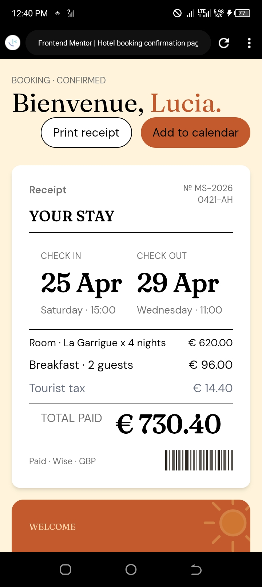

# Frontend Mentor - Hotel booking confirmation page solution

This is a solution to the [Hotel booking confirmation page challenge on Frontend Mentor](https://www.frontendmentor.io/challenges/hotel-booking-confirmation-page). Frontend Mentor challenges help you improve your coding skills by building realistic projects.

## Table of contents

- [Overview](#overview)
  - [The challenge](#the-challenge)
  - [Screenshot](#screenshot)
  - [Links](#links)
- [My process](#my-process)
  - [Built with](#built-with)
  - [What I learned](#what-i-learned)
  - [Continued development](#continued-development)
  - [Useful resources](#useful-resources)
  - [AI Collaboration](#ai-collaboration)
- [Author](#author)
- [Acknowledgments](#acknowledgments)

## Overview

### The challenge

Users should be able to:

- View the optimal layout for the interface depending on their device's screen size
- See hover and focus states for all interactive elements on the page
- Open and close the navigation menu on smaller screens (optional JavaScript)
- Copy the Wi-Fi password to their clipboard using the copy button (optional JavaScript)

### Screenshot

### Links

- Solution URL: [https://github.com/Randyblazedev/hotel-booking](https://github.com/Randyblazedev/hotel-booking)
- Live Site URL: [https://randyblazedev.github.io/hotel-booking/](https://randyblazedev.github.io/hotel-booking/)

## My process

### Built with

- Semantic HTML5 markup
- Tailwind CSS
- Flexbox
- CSS Grid
- Mobile-first workflow
- Vanilla JavaScript

### What I learned

This project reinforced responsive layout patterns using CSS Grid and Flexbox with Tailwind utilities. I also implemented a simple clipboard copy function for the Wi-Fi password using the native Clipboard API.

### Continued development

I want to refine the mobile navigation menu interaction and add subtle animations for a more polished feel.

### Useful resources

- [Tailwind CSS Docs](https://tailwindcss.com/docs) - Quick reference for utility classes
- [Clipboard API on MDN](https://developer.mozilla.org/en-US/docs/Web/API/Clipboard_API) - Used for the copy button functionality

### AI Collaboration

I used Axon AI assistant as a coding partner during this project:

- **Tools used:** Axon (AI chat assistant)
- **How I used it:** Debugging layout issues, generating the Tailwind utility structure, and reviewing HTML semantics
- **What worked well:** Fast iteration on responsive breakpoints and catching missing closing tags
- **What didn't:** Some initial misunderstandings on task scope that got resolved through iteration

## Author

- Frontend Mentor - [@Randyblazedev](https://www.frontendmentor.io/profile/Randyblazedev)
- GitHub - [RandyBlazedev](https://github.com/Randyblazedev)

## Acknowledgments

Frontend Mentor for the challenge design and specifications.
